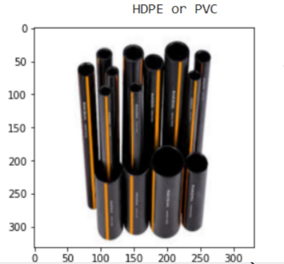

# Autonomous Waste Segregation Robotics
# INTRODUCTION
Taking inspiration from the existing autonomous solutions in the waste management sector we have created a vision system to segregate 5 types of plastic wastes - HDPE, LDPE, PET, PVC, and Polystyrene for different recycling purposes. We have used Pybullet, a Real-Time Physics Simulator to implement a KUKA LBR iiwa robotic arm for picking and sorting plastic wastes in simulation. Simulation and real-world results show that the vision system can classify different plastic wastes. Segregation of different plastic wastes is important since each plastic type has its unique use after recycling. This project has been done under the **Robotics Research Group(RoboReg)** at the **Indian Institute of Technology(BHU) Varanasi.**
* [Approach](#APPROACH)
* [Results](#RESULTS)
* [Team](#TEAM)
* [Mentors](#MENTORS)

# APPROACH
We have created 4 groups for plastic classification using the vision model and chosen 4 plastic objects belonging to each of the respective groups. The respective groups and plastic objects are:

1)**HDPE and PVC** : Pipe

2)**LDPE and HDPE**: Plastic Toys

3)**LDPE , HDPE and PET** : Plastic Bottles

4)**POLYSTYRENE** : Thermocol Sheets

The vision model predicts results both on real-world objects and simulation objects. We aim to successfully classify pictures of these plastic objects both in real-world and simulation environment into their corresponding plastic-type categories.

**THE VISION MODEL**-The vision system classifies given plastic waste image into one of the 4 categories based on the plastic type it is likely to be made of. Transfer Learning VGG-16 model with Deep Convolution Neural Network has been used to have faster and more accurate results.

**KUKA LBR iiwa robotic arm**-The robotic arm used is a modified Kuka arm ( KUKA LBR iiwa robotic arm) where a different gripper has been chosen.
The environment consists of four platforms labeled polystyrene, LDPE or HDPE, HDPE or PVC, HDPE or PET or LDPE placed equally spaced at four corners and with the robotic arm placed at the center. The waste material(object) which is to be classified, is simulated at a certain area.
# RESULTS
**Vision Model Predictions**

   

**KUKA LBR iiwa robotic arm movement**

# TEAM
<table>
  <tr>
    <td align="center"><a href="https://github.com/AntaraB1005"> <b>Antara Banerjee</b></a> </a></td>
     <td align="center"><a href="https://github.com/AtuL-KumaR-00"> <b>Atul Kumar</b></a> </a></td>
      <td align="center"><a href="https://github.com/aditiagrawal123"> <b>Aditi Agrawal</b></a> </a></td>
    </tr>
</table>

# MENTORS
<table>
  <tr>
    <td align="center"><a href="https://github.com/lok-i"> <b>Lokesh Krishna</b></a> </a></td>
    <td align="center"><a href="https://github.com/NiranthS"> <b>Niranth Sai</b></a> </a></td>
    </tr>
</table>
